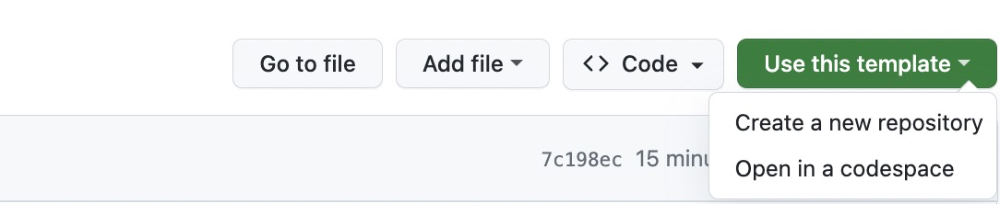
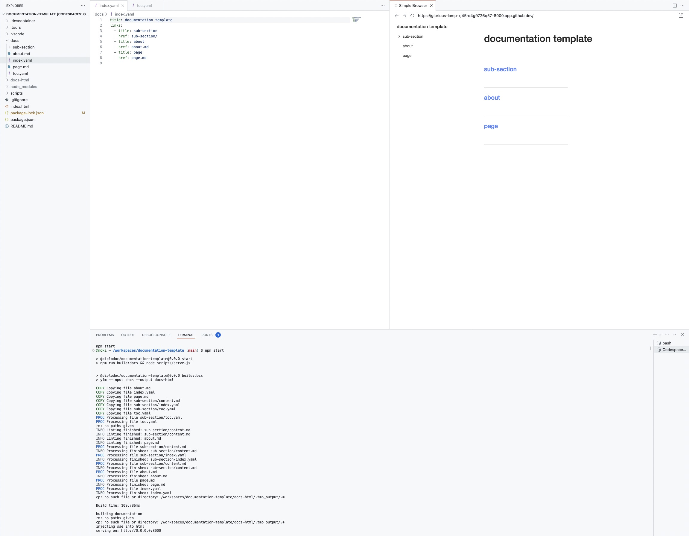

# Система координации поиска и спасения (SARC)

## Локальная разработка

```
> npm start

> listening on 0.0.0.0:8000

```

### github codespaces

press Use this template -> Open in a codespace



wait for the development server startup

enjoy developing documentation with html result preview in split view


